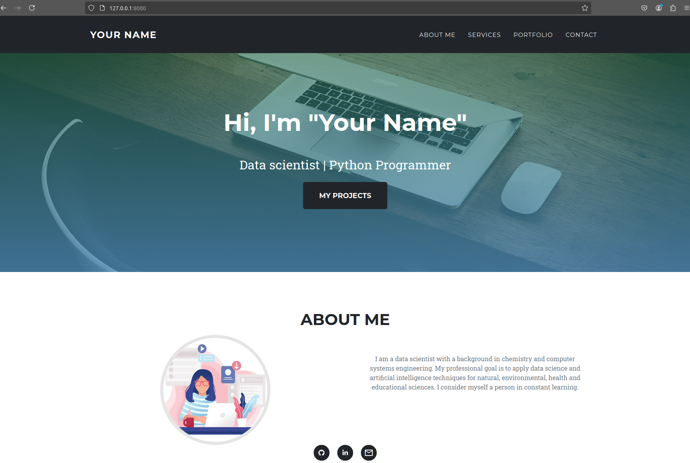
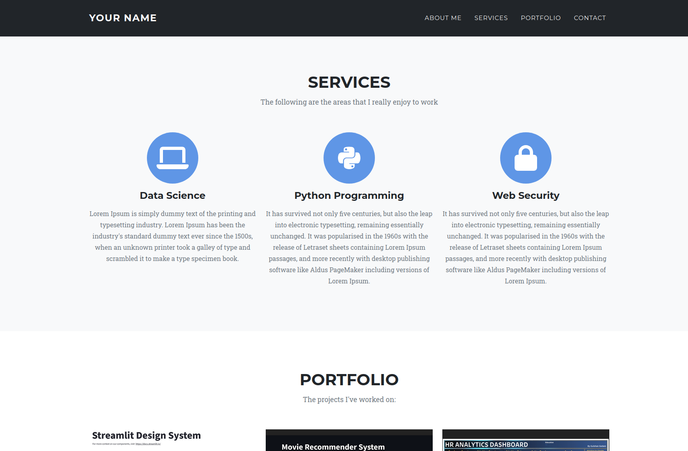
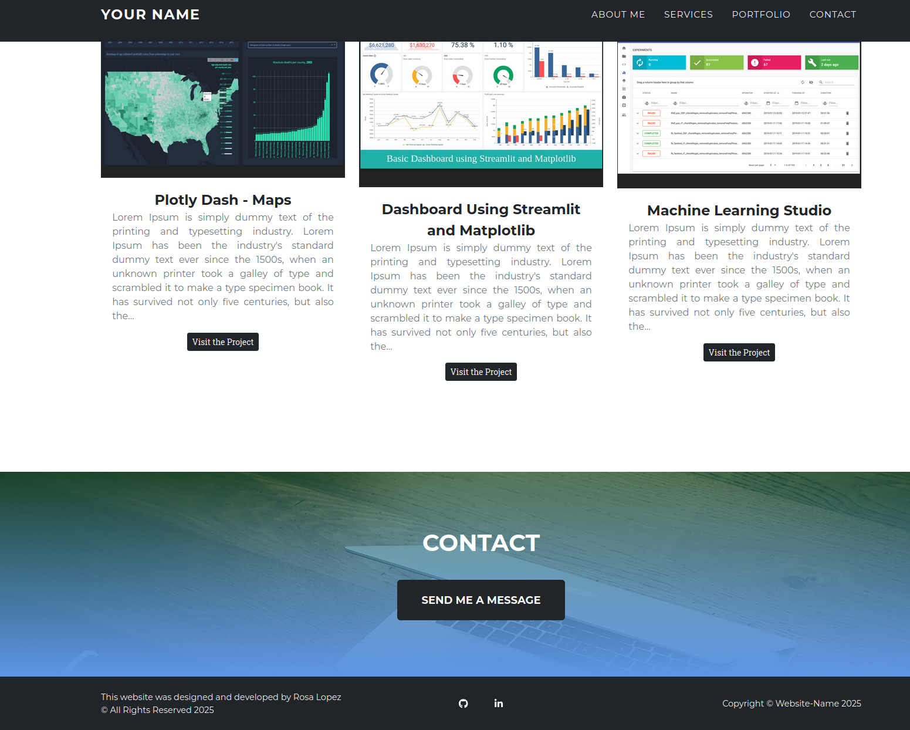

# Django-Portfolio-Website

This is a Python Django-based personal portfolio website.

The fronted is based on the [Start Bootstrap Agency Template](https://startbootstrap.com/theme/agency) .


## Images of the Django-Portfollio-Website project








## My website portfolio

Please visit my portfolio website that is similar in design:
https://www.rosa-lopez.com/
 


## Steps to run locally

Clone the project

```
git clone https://github.com/rosa-lpz/Django-Portfolio-Website.git
```


Go to the project directory 

```
cd Django-Portfolio-Website
```


Create a virtual environment and install the requirements listed in "requirements.txt" file

```
pip install -r requirements.txt
```


Make migrations

```
python manage.py makemigrations
python manage.py migrate
```


Run the server

```
python manage.py runserver
```


Go to `http://127.0.0.1:8000/admin/` 
